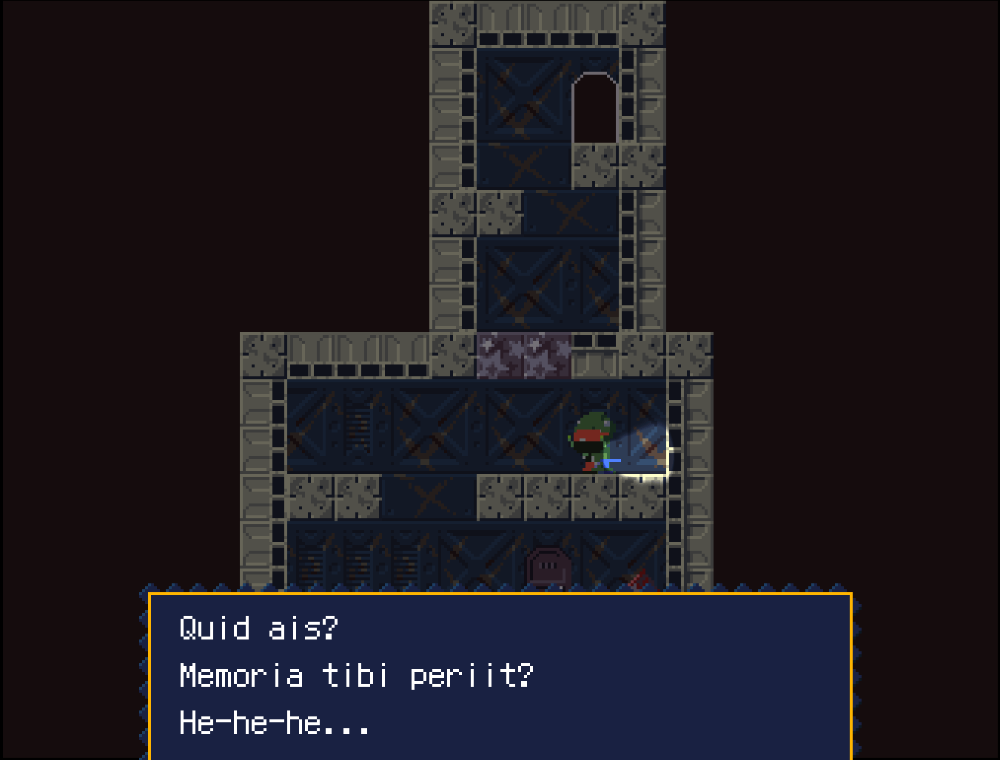

# doukutsu-translator


Automated tool for translating Cave Story into Latin with LLMs, for
fun and as an experiment in language pedagogy. Handcoded, not
vibecoded!

## Structure
This tool has two components:
- a Rust tool (doukutsu-extractor) that can both extract .tsc data
  from Cave Story into a JSON dialogue file as well as convert that
  file back into .tsc files readily usable for the game.
- a Python tool (translate.py) that takes this dialogue file and
  translates each dialogue into Latin.

## Usage
The project can be used thus:
```sh
git clone https://github.com/semilin/doukutsu-translator
cd doukutsu-translator
cargo r dump --translation_file english.json --game_data ~/games/CaveStory/data/ # replace with your own directory

# it's generally good practice to use a venv,
# but if your environment isn't managed by your package manager
# and you don't care about keeping it clean, then this is fine.
pip install -r requirements.txt

export OPENROUTER_API_KEY=yourkey

python translate.py t english.json latin.json

cargo r write --translation_file latin.json --output_dir translation
```

Then, recursively copy the resulting `translation/` directory into
your `CaveStory/data` directory, and you're good to go.

## Logistics
It cost me about $0.90 to produce a full game translation with
gemini-3-flash-preview on OpenRouter. I tried other models, but
anything at a similar price point was unable to even return properly
formatted JSON. Probably a prompting issue, but I don't care enough to
adapt it.

## Modification
This project is trivially modifiable for other purposes. Just edit
translate.py to use different LLM endpoints. Prompting merely needs to
be adjusted slightly for translation to other languages (but note that
you'll need to make modifications to the game font in order to display
other characters).

## License
GPLv3, copyright semilin
